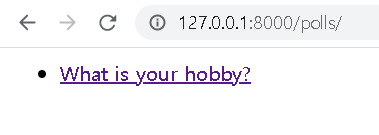
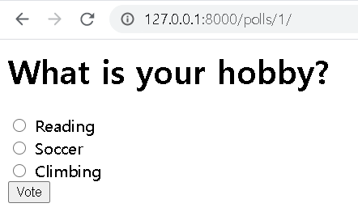
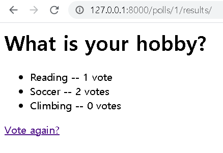

# 1. 파이썬 프로그래밍

## (1) 파이썬 코드

```python
import sys

if sys.argv[1]=="-cp":
    from_f=sys.argv[2]
    to_f=sys.argv[3]
    
    source_f=open(from_f,"rt", encoding="UTF8")
    result_f=open(to_f,"wt", encoding="UTF8")

    while True:
        row=source_f.readline()
        if not row: break
        result_f.write(row)
    
    source_f.close()
    result_f.close()
```


## (2) 실행결과

- 실행 전

  

- 실행

  ```shell
  >python mycopy.py -cp fromfile.txt tofile.txt
  ```

- 실행 후

  


# 2. 게시판 사이트 DB 모델링

## (1) ERD


## (2) 테이블 및 SQL문

- memberTBL

  | 필드     | 데이터형식     | 설명     |
  | -------- | -------------- | -------- |
  | memID    | CHAR, NOT NULL | ID, PK   |
  | memName  | CHAR, NOT NULL | 이름     |
  | memPW    | CHAR, NOT NULL | PW       |
  | memNum   | INT, NOT NULL  | 회원번호 |
  | memSex   | CHAR           | 성별     |
  | memMail  | CHAR           | 이메일   |
  | memPhone | INT, NOT NULL  | 전화번호 |
  | memAddr  | CHAR           | 주소     |

  ```sql
  CREATE TABLE `membertbl` (
  	`memName` CHAR(3) NOT NULL COLLATE 'utf8_general_ci',
  	`memID` CHAR(20) NOT NULL COLLATE 'utf8_general_ci',
  	`memPW` CHAR(20) NOT NULL COLLATE 'utf8_general_ci',
  	`memNum` INT(8) NOT NULL,
  	`memSex` CHAR(1) NULL DEFAULT NULL COLLATE 'utf8_general_ci',
  	`memMail` CHAR(20) NULL DEFAULT NULL COLLATE 'utf8_general_ci',
  	`memPhone` INT(11) NOT NULL,
  	`memAddr` CHAR(20) NULL DEFAULT NULL COLLATE 'utf8_general_ci',
  	PRIMARY KEY (`memID`) USING BTREE
  )
  COLLATE='utf8_general_ci'
  ENGINE=InnoDB
  ;
  ```

  

- boardTBL

  | 필드        | 데이터형식     | 설명                        |
  | ----------- | -------------- | --------------------------- |
  | postNum     | INT, NOT NULL  | 게시글 번호, PK             |
  | postTitle   | CHAR, NOT NULL | 게시글 제목                 |
  | postContent | CHAR, NOT NULL | 게시글 내용                 |
  | memID       | CHAR, NOT NUL  | 작성자 ID, FK(memTBL.memID) |
  | postWhen    | INT, NOT NULL  | 작성 날짜                   |
  | postHit     | INT, NOT NULL  | 조회수                      |

  ```sql
  CREATE TABLE `boardtbl` (
  	`postNum` INT(15) NOT NULL,
  	`postTitle` CHAR(20) NOT NULL COLLATE 'utf8_general_ci',
  	`postContent` CHAR(100) NOT NULL COLLATE 'utf8_general_ci',
  	`memID` CHAR(20) NOT NULL COLLATE 'utf8_general_ci',
  	`postWhen` INT(8) NOT NULL,
  	`postHit` INT(100) NOT NULL,
  	PRIMARY KEY (`postNum`) USING BTREE,
  	UNIQUE INDEX `UK_boardtbl_postWho` (`memID`) USING BTREE,
  	CONSTRAINT `FK_boardtbl_membertbl_memID` FOREIGN KEY (`memID`) REFERENCES `modeldb`.`membertbl` (`memID`) ON UPDATE NO ACTION ON DELETE NO ACTION
  )
  COLLATE='utf8_general_ci'
  ENGINE=InnoDB
  ;
  ```

  

- commentTBL

  | 필드           | 데이터형식     | 설명                              |
  | -------------- | -------------- | --------------------------------- |
  | commentNum     | INT, NOT NULL  | 댓글 번호                         |
  | memID          | CHAR, NOT NULL | 댓글 작성자 ID, FK(memTBL.memID)  |
  | commentContent | CHAR           | 댓글 내용                         |
  | commentDate    | INT, NOT NUL   | 댓글 작성 날짜                    |
  | postNum        | INT, NOT NULL  | 게시글 번호, FK(boardTBL.postNum) |

  ```sql
  CREATE TABLE `commenttbl` (
  	`commentNum` INT(15) NOT NULL,
  	`memID` CHAR(20) NOT NULL COLLATE 'utf8_general_ci',
  	`commentContent` CHAR(100) NULL DEFAULT NULL COLLATE 'utf8_general_ci',
  	`commentDate` INT(8) NOT NULL,
  	`postNum` INT(15) NOT NULL,
  	INDEX `FK_commenttbl_boardtbl_postNum` (`postNum`) USING BTREE,
  	INDEX `FK_commenttbl_membertbl_memID` (`memID`) USING BTREE,
  	CONSTRAINT `FK_commenttbl_boardtbl_postNum` FOREIGN KEY (`postNum`) REFERENCES `modeldb`.`boardtbl` (`postNum`) ON UPDATE NO ACTION ON DELETE NO ACTION,
  	CONSTRAINT `FK_commenttbl_membertbl_memID` FOREIGN KEY (`memID`) REFERENCES `modeldb`.`membertbl` (`memID`) ON UPDATE NO ACTION ON DELETE NO ACTION
  )
  COLLATE='utf8_general_ci'
  ENGINE=InnoDB
  ;
  ```

  

- fileTBL

  | 필드      | 데이터형식     | 설명                              |
  | --------- | -------------- | --------------------------------- |
  | memID     | CHAR, NOT NULL | 작성자 ID, FK(memTBL.memID)       |
  | fileName  | CHAR, NOT NULL | 작성자 ID                         |
  | fileWhere | CHAR, NOT NULL | 파일 주소                         |
  | fileWhen  | INT, NOT NUL   | 작성 날짜                         |
  | postNum   | INT, NOT NULL  | 게시글 번호, FK(boardTBL.postNum) |

  ```sql
  CREATE TABLE `filetbl` (
  	`memID` CHAR(20) NOT NULL COLLATE 'utf8_general_ci',
  	`fileName` CHAR(20) NOT NULL COLLATE 'utf8_general_ci',
  	`fileWhere` CHAR(30) NOT NULL COLLATE 'utf8_general_ci',
  	`fileWhen` INT(8) NOT NULL,
  	`postNum` INT(15) NOT NULL,
  	INDEX `FK_filetbl_boardtbl_postNum` (`postNum`) USING BTREE,
  	INDEX `FK_filetbl_boardtbl_postWho` (`memID`) USING BTREE,
  	CONSTRAINT `FK_filetbl_boardtbl_postNum` FOREIGN KEY (`postNum`) REFERENCES `modeldb`.`boardtbl` (`postNum`) ON UPDATE NO ACTION ON DELETE NO ACTION,
  	CONSTRAINT `FK_filetbl_membertbl_memID` FOREIGN KEY (`memID`) REFERENCES `modeldb`.`membertbl` (`memID`) ON UPDATE NO ACTION ON DELETE NO ACTION
  )
  COLLATE='utf8_general_ci'
  ENGINE=InnoDB
  ;
  ```

  


# 3. 질문 및 투표 사이트 with Django

## (1) 프로젝트 생성p

```shell
C:\RedBook>django-admin startproject ch3	// 프로젝트 생성
C:\RedBook\ch3>python manage.py startapp polls	// 애플리케이션 생성
```


## (2) Model

```shell
C:\RedBook\ch3\polls>notepad models.py
C:\RedBook\ch3\polls>notepad admin.py
C:\RedBook\ch3>python manage.py makemigrations	// DB에 변경사항 반영
C:\RedBook\ch3>python manage.py migrate
```

- Question, Choice 테이블 정의 (`models.py`)

  ```django
  from django.db import models
  
  class Question(models.Model):
  	question_text = models.CharField(max_length=200)
  	pub_date = models.DateTimeField('date published')
  
  	def __str__(self):
  		return self.question_text
  
  class Choice(models.Model):
  	question = models.ForeignKey(Question, on_delete= models.CASCADE)
  	choice_text = models.CharField(max_length=200)
  	votes = models.IntegerField(default =0)
  	
  	def __str__(self):
  		return self.choice_text
  ```

- Admin 사이트에 테이블 반영 (`admin.py`)

  ```django
  from django.contrib import admin
  from polls.models import Question,Choice
  
  admin.site.register(Question)
  admin.site.register(Choice)
  ```

- Admin 사이트 화면

  


## (3) View & Template

- URLconf 코딩

  ```shell
  C:\RedBook\ch3\mysite>notepad urls.py
  ```

  ```django
  from django.contrib import admin
  from django.urls import path, include
  
  urlpatterns = [
      path('admin/', admin.site.urls),
      path('polls/', include('polls.urls')),
  ]
  ```


- view.index() 함수 및 index.html 작성

  ```shell
  C:\RedBook\ch3\polls\templates\polls>notepad index.html
  ```

  ```django
  
      <ul>
      
          <li><a href="/polls/{{ question.id }}/">{{ question.question_text }}</a></li>
      
      </ul>
  
      <p>No polls are available.</p>
  
  ```

  

  ```sh
  C:\RedBook\ch3\polls>notepad views.py
  
  from django.shortcuts import render
  from polls.models import Question
  ```

  ```django
  def index(request):
      latest_question_list = Question.objects.all().order_by('-pub_date')[:5]
      context = {'latest_question_list': latest_question_list}
      return render(request, 'polls/index.html', context)
  ```


- view.detail() 함수 및 detail.html 작성

  ```shell
  C:\RedBook\ch3\polls\templates\polls>notepad detail.html
  ```

  ```django
  <h1>{{ question.question_text }}</h1>
  
  <p><strong>{{ error_message }}</strong></p>
  
  <form action="" method="post">
  
  
      <input type="radio" name="choice" id="choice{{ forloop.counter }}" value="{{ choice.id }}" />
      <label for="choice{{ forloop.counter }}">{{ choice.choice_text }}</label><br />
  
  <input type="submit" value="Vote" />
  </form>
  ```

  

  ```shell
  C:\RedBook\ch3\polls>notepad views.py
  
  from django.shortcuts import get_object_or_404, render
  ```

  ```django
  def detail(request, question_id):
      question = get_object_or_404(Question, pk=question_id)
      return render(request, 'polls/detail.html', {'question': question})
  ```

  

- view.vote() 함수 및 리다이렉션 작성

  ```shell
  C:\RedBook\ch3\polls>notepad views.py
  
  from django.http import HttpResponseRedirect
  from django.urls import reverse
  from polls.models import Choice, Question
  ```

  ```django
  def vote(request, question_id):
      question = get_object_or_404(Question, pk=question_id)
      try:
          selected_choice = question.choice_set.get(pk=request.POST['choice'])
      except (KeyError, Choice.DoesNotExist):
          # Redisplay the question voting form.
          return render(request, 'polls/detail.html', {
              'question': question,
              'error_message': "You didn't select a choice.",
          })
      else:
          selected_choice.votes += 1
          selected_choice.save()
          # Always return an HttpResponseRedirect after successfully dealing
          # with POST data. This prevents data from being posted twice if a
          # user hits the Back button.
          return HttpResponseRedirect(reverse('polls:results', args=(question.id,)))
  ```

  

- view.result() 함수 및 results.html 작성

  ```shell
  C:\RedBook\ch3\polls\templates\polls>notepad results.html
  ```

  ```django
  <h1>{{ question.question_text }}</h1>
  
  <ul>
  
      <li>{{ choice.choice_text }} -- {{ choice.votes }} vote{{ choice.votes|pluralize }}</li>
  
  </ul>
  
  <a href="">Vote again?</a>
  ```

  

  ```shell
  C:\RedBook\ch3\polls>notepad views.py
  ```

  ```django
  def results(request, question_id):
      question = get_object_or_404(Question, pk=question_id)
      return render(request, 'polls/results.html', {'question': question})
  ```

  

## (4) 실행 결과





